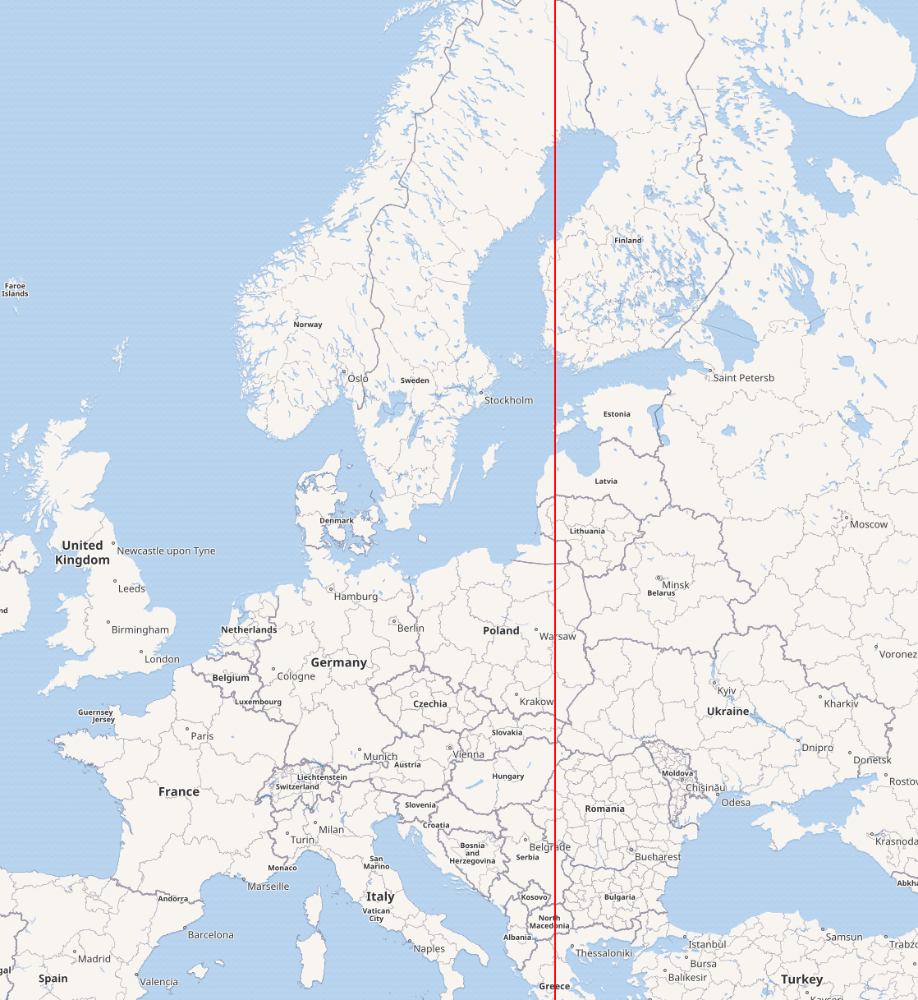

# OpenChain-Meridian22

## Intro

OpenChain Meridian 22 is a subgroup of the Linux Foundation's [OpenChain Project](https://openchainproject.org/).

It focuses on the countries in and round the 22nd Meridian of the European Continent, what can broadly be called central and eastern Europe.

image source: https://en.wikipedia.org/wiki/22nd_meridian_east

Our goal is to promote the OpenChain community and ISO standards in these countries, and to regularly discuss local developments in open source software, open source management, compliance, and security in the open source software supply chain.

## Get Involved

Our calls are open to anyone who would like to participate. Join the Mailing List [here](https://lists.openchainproject.org/g/meridian22-wg).
